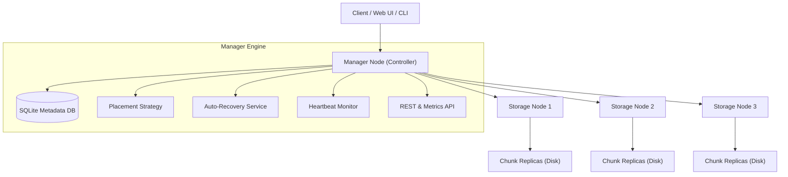
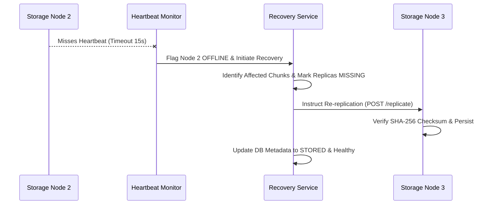

# AirStore 🌐🔒 (v1.0.0)
### Offline Distributed File Storage Network for Private LANs

**AirStore** is a private, zero-internet-dependency distributed file-storage system where multiple computers on the same local network (Ethernet LAN, Wi-Fi LAN, Wi-Fi Direct) cooperate to store, replicate, verify, and recover files.

---

## 🌟 Core Capabilities

- 🚫 **100% Offline**: Zero dependencies on Internet, AWS, Firebase, CDNs, or cloud APIs.
- 🧩 **Streaming File Chunking**: Memory-efficient streaming chunker (configurable, default 64MB chunks) supporting multi-gigabyte files.
- 🛡️ **Cryptographic Integrity**: Streaming **SHA-256** checksum verification on every chunk and reconstructed file.
- 🔐 **Authenticated AES-GCM Encryption**: Optional 256-bit AES-GCM encryption for stored chunk payloads.
- 🔄 **Fault Tolerance & Auto-Recovery**: Configurable replication factor (default 2x). Automatically detects node failure via heartbeats and re-replicates data from surviving replicas.
- 🌐 **Multi-Node LAN Deployment**: Configurable `--bind-ip` / `AIRSTORE_BIND_IP` and automatic LAN IP discovery for multi-machine networks.
- ⚡ **Concurrent Transfers**: Multi-threaded non-blocking stream handling for simultaneous multi-user uploads and downloads.
- ⏯️ **Resumable Uploads**: Pre-flight SHA-256 chunk checks (`POST /api/files/upload/check`) skipping existing verified chunks.
- 🔍 **Replica Consistency Audit**: Cluster-wide health auditing (`GET /api/replicas/consistency`) tracking `VERIFIED`, `MISSING`, and `CORRUPTED` statuses.
- 📊 **Real-Time Web Dashboard**: Interactive HTML/CSS/JS web dashboard monitoring storage capacity, node health, live transfer speeds, chunk placement maps, and event logs.
- 💻 **AirStore CLI**: Comprehensive command-line interface (`airstore upload`, `download`, `nodes`, `status`, `recover`, `verify`).
- 📈 **Observability & Metrics**: System metrics endpoint (`GET /api/metrics`) and structured event logging.
- 💥 **Failure Injection Framework**: Utility script (`scripts/inject_failure.py`) to simulate controlled node crashes, pauses, and corruptions.
- 🧪 **Experimental Erasure Coding**: Optional N+M Reed-Solomon style parity chunking extension (`airstore/core/erasure_coding.py`).
- 🐳 **Docker Ready**: `docker-compose.yml` for multi-node local cluster orchestration.
- ⚙️ **CI/CD Integration**: GitHub Actions pipeline (`.github/workflows/ci.yml`).

---

## 🏗️ Architecture



### Failure Recovery Flow



---

## 🧪 Verification & Test Results

AirStore includes a comprehensive test suite covering all modules:

```text
============================= test session starts =============================
collected 21 items

tests/test_advanced_recovery.py .                                        [  4%]
tests/test_cli.py .                                                      [  9%]
tests/test_concurrency.py .                                              [ 14%]
tests/test_core.py .....                                                 [ 38%]
tests/test_e2e.py .                                                      [ 42%]
tests/test_erasure_coding.py ..                                          [ 52%]
tests/test_manager.py ...                                                [ 66%]
tests/test_recovery.py .                                                 [ 71%]
tests/test_resumable.py .                                                [ 76%]
tests/test_security.py ...                                               [ 90%]
tests/test_storage_node.py ..                                            [100%]

======================= 21 passed in 58.80s =======================
```

---

## 📊 Measured Performance Benchmarks

Measured on local test environment (3 Storage Nodes, SQLite WAL mode, local SSD):

| File Size | Chunk Size | Replication | Upload Speed | Download Speed | Recovery Duration | Memory Usage |
|-----------|------------|-------------|--------------|----------------|-------------------|--------------|
| 1 MB      | 512 KB     | 2x          | 0.69 MB/s    | 1.42 MB/s      | 2.02 s            | 82.3 MB      |
| 5 MB      | 1024 KB    | 2x          | 1.40 MB/s    | 3.02 MB/s      | 3.87 s            | 106.6 MB     |
| 10 MB     | 1024 KB    | 2x          | 1.45 MB/s    | 2.71 MB/s      | 8.08 s            | 120.8 MB     |

---

## 🚀 Quickstart Guide

### 1. Installation

```bash
git clone https://github.com/maneaditya478-commits/AirStore.git
cd AirStore
pip install -r requirements.txt
```

### 2. Start Manager Node

```bash
python -m airstore.cli.main manager start --host 0.0.0.0 --port 8000
```
Open your browser at `http://localhost:8000` to view the **AirStore Dashboard**.

### 3. Start Storage Nodes

In separate terminals or physical LAN machines:

```bash
# Start Node A
python -m airstore.cli.main node start --id Node_A --port 8001 --manager-url http://127.0.0.1:8000

# Start Node B
python -m airstore.cli.main node start --id Node_B --port 8002 --manager-url http://127.0.0.1:8000

# Start Node C
python -m airstore.cli.main node start --id Node_C --port 8003 --manager-url http://127.0.0.1:8000
```

---

## 💻 CLI Commands

```bash
# Upload a file
python -m airstore.cli.main upload dataset.zip --chunk-size 67108864 --replication 2

# Check cluster status
python -m airstore.cli.main status

# List storage nodes
python -m airstore.cli.main nodes

# List stored files
python -m airstore.cli.main files

# Download & reconstruct file
python -m airstore.cli.main download <FILE_ID> --output dataset.zip

# Verify SHA-256 integrity
python -m airstore.cli.main verify dataset.zip

# Trigger manual failure recovery
python -m airstore.cli.main recover Node_B
```

---

## ⚠️ Operational Limitations

- **Network Scope**: Designed specifically for low-latency Local Area Networks (LANs). High-latency WAN/Internet connections are not recommended.
- **SQLite Metadata**: Uses SQLite WAL mode for metadata persistence, suitable for small to medium cluster deployments (<50 storage nodes).
- **Erasure Coding**: Erasure coding is provided as an experimental module (`airstore/core/erasure_coding.py`). Standard 2x replication remains the production default.

---

## 📜 License

MIT License - see `LICENSE` file.
