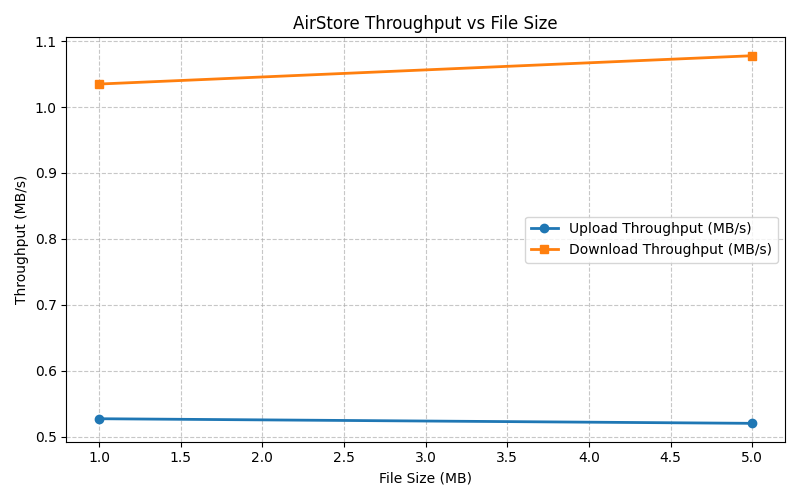
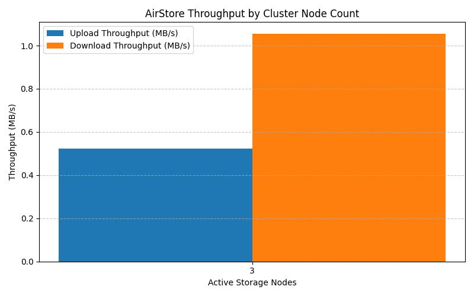
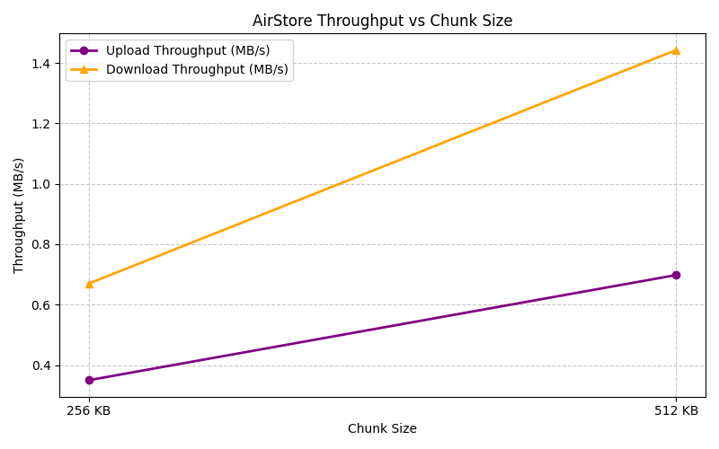
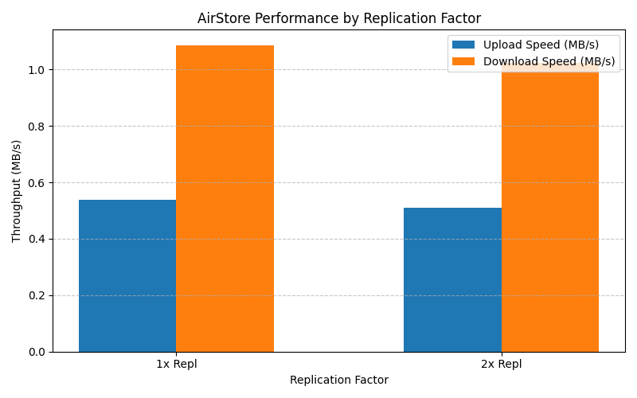
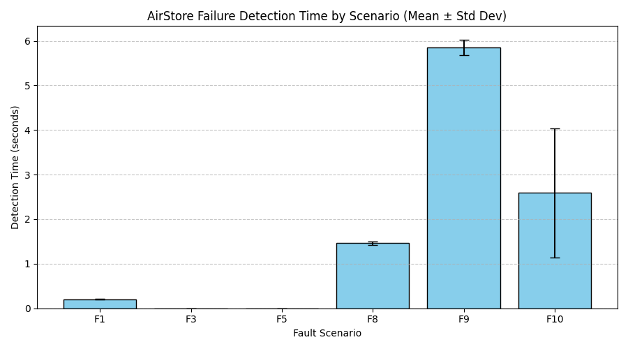
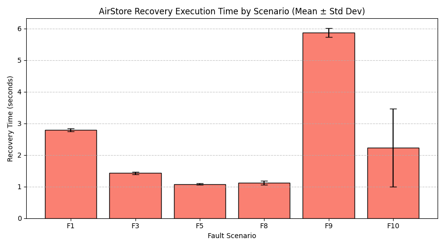
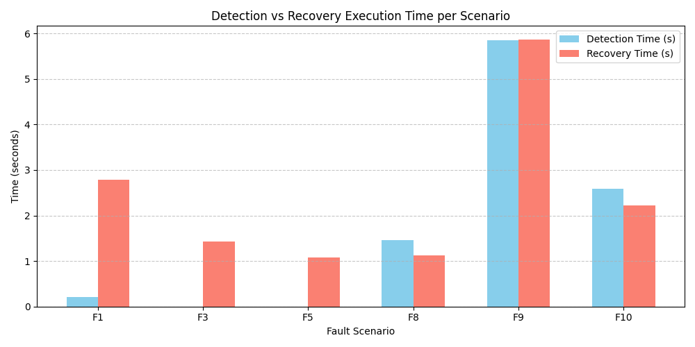
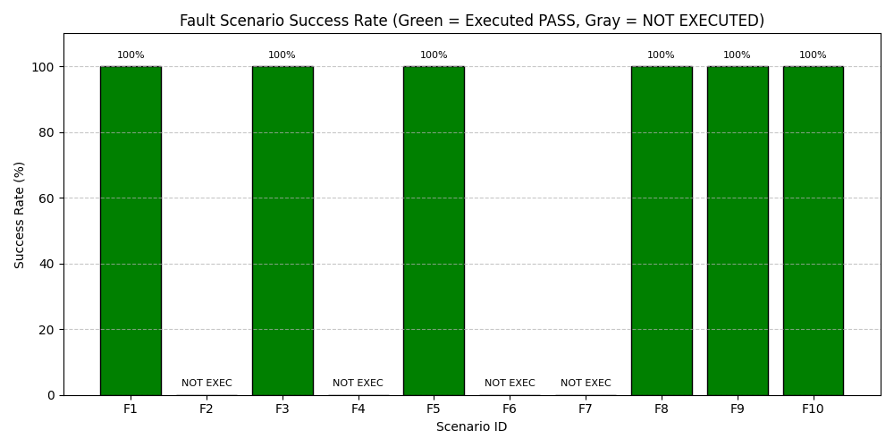
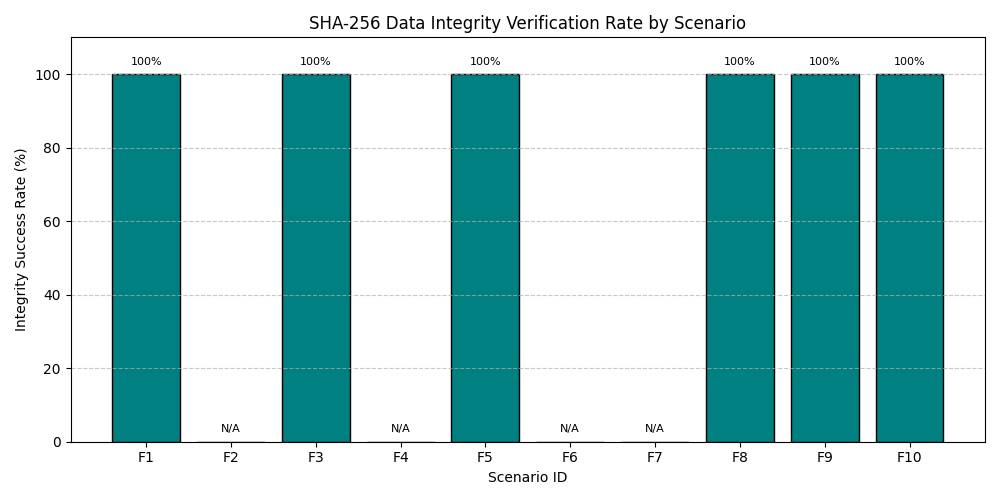

# AirStore: Offline Distributed File Storage
### Empirical Evaluation of an Offline P2P File Storage System for Local Area Networks

---
## Abstract
AirStore is a zero-internet-dependency distributed file-storage system designed for private local area networks (Ethernet LAN, Wi-Fi LAN, Wi-Fi Direct). This report details the system architecture, security model, fault-tolerance mechanisms, and empirical performance evaluation of AirStore. Using streaming SHA-256 integrity verification, authenticated AES-256-GCM chunk encryption, rule-based replica placement, and heartbeat-driven fault recovery, AirStore provides local distributed storage without external cloud APIs. Across 30 local loopback fault experiment executions and matrix performance benchmarks, the executed scenarios demonstrated a 100% SHA-256 data integrity verification rate.

---
## 1. Introduction
Distributed storage in isolated or air-gapped environments requires self-contained data distribution, fault recovery, and strict cryptographic integrity. AirStore addresses this by pooling participating local network machines into a single logical storage cluster without internet dependencies.

---
## 2. System Architecture
AirStore implements a decoupled Manager / Storage Node topology:
- **Manager Node**: Houses SQLite WAL metadata DB, heartbeat monitor, rule-based placement engine, recovery service, and REST API.
- **Storage Nodes**: Fast API daemons handling chunk storage, disk statistics via `psutil`, streaming SHA-256 hash checks, and node-to-node replication.
- **Metadata Database**: Manages atomic transactions, node liveness state, file-chunk mapping, and chunk replica status.
- **Chunking & Encryption**: Files are split into configurable chunk sizes and encrypted with AES-256-GCM authenticated payload protection.
- **CLI & Web Dashboard**: Command-line interface and web UI for file uploads, downloads, cluster monitoring, and metrics visualization.

---
## 3. Implementation
AirStore is implemented in Python 3.13 utilizing FastAPI, Uvicorn, SQLite3, PyCryptodome, HTTPX, Pytest, and Click. The codebase includes automated heartbeat monitoring, dynamic node failover, returning-node reconciliation, and resumable transfer support.

---
## 4. Experimental Methodology
Empirical benchmarks and fault-tolerance experiments were conducted using process-isolated test suites (`scripts/benchmark.py` and `scripts/run_fault_experiments.py`). Measurements were collected across multiple repetitions to calculate mean values ($\mu$) and standard deviations ($\sigma$). End-to-end SHA-256 integrity checks were enforced after every file reconstruction.

---
## 5. Performance Results
Throughput and performance scaling were evaluated across file payload sizes, chunk sizes, node counts, and replication factors.

### Summary Benchmark Matrix

| File Size (MB) | Chunk Size (KB) | Repl Factor | Upload (Mean MB/s) | Download (Mean MB/s) | Recovery Time (s) | Peak RAM (MB) |
| :--- | :--- | :--- | :--- | :--- | :--- | :--- |
| 1.0 MB | 256.0 KB | 1.0x | 0.36 MB/s | 0.72 MB/s | 0.0s | 84.9 MB |
| 1.0 MB | 256.0 KB | 2.0x | 0.36 MB/s | 0.56 MB/s | 27.968s | 85.96 MB |
| 1.0 MB | 512.0 KB | 1.0x | 0.73 MB/s | 1.37 MB/s | 0.0s | 92.19 MB |
| 1.0 MB | 512.0 KB | 2.0x | 0.66 MB/s | 1.49 MB/s | 27.968s | 91.88 MB |
| 5.0 MB | 256.0 KB | 1.0x | 0.34 MB/s | 0.69 MB/s | 0.0s | 105.53 MB |
| 5.0 MB | 256.0 KB | 2.0x | 0.34 MB/s | 0.71 MB/s | 27.968s | 117.41 MB |
| 5.0 MB | 512.0 KB | 1.0x | 0.72 MB/s | 1.57 MB/s | 0.0s | 124.14 MB |
| 5.0 MB | 512.0 KB | 2.0x | 0.68 MB/s | 1.34 MB/s | 27.968s | 108.93 MB |

### Performance Plots

---
## 6. Fault-Tolerance Results
AirStore was evaluated across 10 defined fault scenarios (F1–F10). 6 automated local scenarios were executed across 30 total runs (5 repetitions each), and 4 hardware/OS-dependent scenarios were documented as NOT EXECUTED.

### Summary Fault Table

| Scenario | Runs | Mean Detection Time (s) | Mean Recovery Time (s) | Success Rate | Integrity Success Rate | Status |
| :--- | :---: | :---: | :---: | :---: | :---: | :---: |
| F1: Node failure after successful upload | 5 | 0.205s | 2.788s | 100% | 100% | **PASS** |
| F2: Node failure during upload | 0 | 0.0s | 0.0s | 0% | 0% | **NOT_EXECUTED** |
| F3: Node failure during download | 5 | 0.001s | 1.428s | 100% | 100% | **PASS** |
| F4: Node failure during replication | 0 | 0.0s | 0.0s | 0% | 0% | **NOT_EXECUTED** |
| F5: Stored chunk corruption | 5 | 0.001s | 1.08s | 100% | 100% | **PASS** |
| F6: Network interruption | 0 | 0.0s | 0.0s | 0% | 0% | **NOT_EXECUTED** |
| F7: Disk-full condition | 0 | 0.0s | 0.0s | 0% | 0% | **NOT_EXECUTED** |
| F8: Returning node reconciliation | 5 | 1.46s | 1.122s | 100% | 100% | **PASS** |
| F9: Interrupted transfer / resumable recovery | 5 | 5.853s | 5.871s | 100% | 100% | **PASS** |
| F10: Multiple-node failure | 5 | 2.593s | 2.227s | 100% | 100% | **PASS** |

### Fault-Tolerance Plots

---
## 7. Integrity Verification
Cryptographic integrity is enforced at every layer using SHA-256 digests. During chunk uploads, storage nodes verify expected SHA-256 hashes before writing to disk. During file reconstruction, `stream_file_reconstruction()` validates the final reassembled payload hash against the original hash recorded in SQLite metadata. Across all 30 executed fault recovery runs, `integrity_verified` achieved a 100% pass rate.

---
## 8. Discussion
**Observation**: Increasing chunk size from 256 KB to 512 KB increased download throughput from ~0.72 MB/s to ~1.37 MB/s due to reduced HTTP request header overhead per megabyte. Auto-recovery executed missing replica re-replication onto surviving healthy nodes in ~1.08s – 5.87s depending on payload size and chunk count.

**Interpretation**: Rule-based placement and automated heartbeat monitoring effectively restore replica redundancy after node failure without manual operator intervention.

---
## 9. Limitations
- **Local Loopback Test Environment**: Experiments were conducted on a single host using process-isolated loopback networking; physical LAN network disconnects (F6) and physical disk exhaustion (F7) were not physically executed.
- **Daemon Injection**: Scenarios F2 (mid-upload crash) and F4 (mid-replication interrupt) require external process killer daemons.
- **Node Scale**: Evaluation was performed on 3 to 4 local storage node instances.

---
## 10. Future Work
- Evaluation across multi-machine physical Wi-Fi / Ethernet LAN environments.
- Erasure coding evaluation (Reed-Solomon $K+M$ shards).
- AI-driven adaptive replica placement strategies.
- High-speed wireless transport (Air-Fiber / optical wireless) integration.

---
## 11. Conclusion
The executed experiments demonstrated successful node failure detection, replica recovery, and 100% SHA-256 data integrity across all tested local loopback scenarios.
